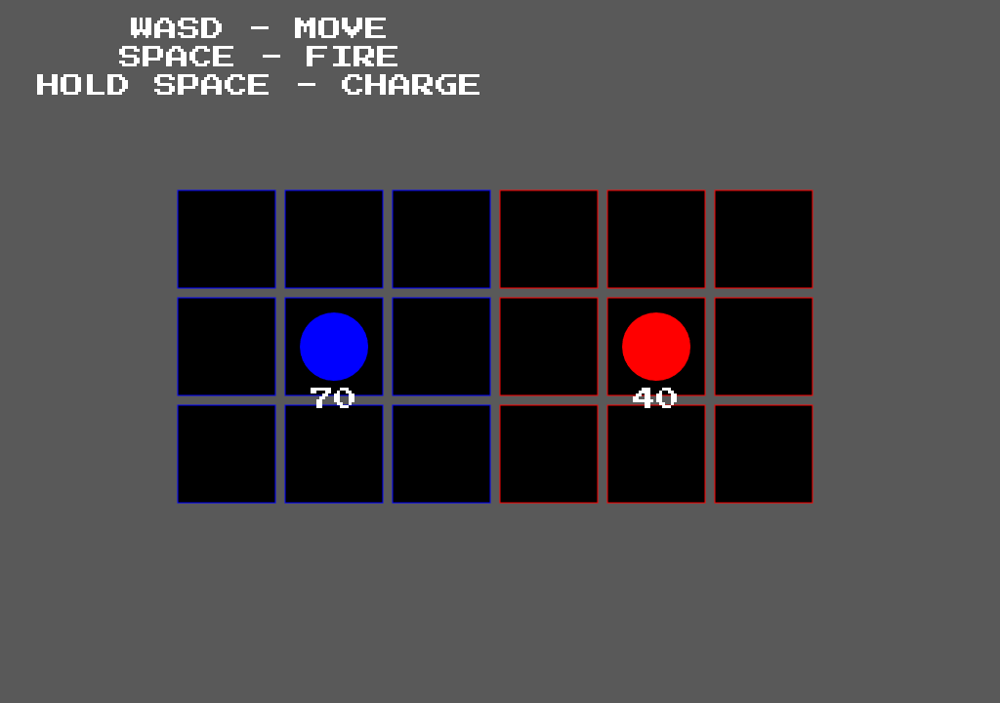

# Mega Buster using Javascript

This is a practice project using javascript to recreate the mega buster from "Megaman Battle Network"

## Table of contents

- [Overview](#overview)
  - [The challenge](#the-challenge)
  - [Screenshot](#screenshot)
  - [Links](#links)
- [My process](#my-process)
  - [Built with](#built-with)
  - [What I learned](#what-i-learned)
  - [Continued development](#continued-development)

## Overview

### The challenge

Users should be able to:

- Play against an enemy similar to a Mettaur from the series "Megaman Battle Network"
- Use the basic mechanics of the mega buster
- See health update per hit

### Screenshot



### Links

- Solution URL: [GitHub](https://github.com/Sengsith/mega-buster)
- Live Site URL: [Netlify](https://ahreo-megabuster.netlify.app/)

## My process

### Built with

- Javascript

### What I learned

This is the first game mechanic that I've really wanted to try to create myself as it comes from a game that I really enjoy playing called "Megaman Battle Network". I recreated the most basic enemy encounter from the series called a Mettaur. The encounters take place on a 3 x 6 grid where the player and enemy have their own tiles respectively. They can move around on each tile and dish out various attacks. There is an aspect similar to deck building in the game, however it is not included in the short demo that I recreated.

```js
function Tile ({position, size, tileIndex, playerObj, enemyObj}) {
  this.position = position;
  this.size = size;
  this.tileIndex = tileIndex;
  this.playerObj = playerObj;
  this.enemyObj = enemyObj;
  this.attackObj = {};
  this.centerPosition = {
    x: this.position.x + (this.size.width / 2),
    y: this.position.y + (this.size.height / 2)
  };
  this.fillColor = "black";
  ...
}
```

I created each Tile as an object which will hold various properties such as the player, enemy, and the attackObj. There is another object called Field:

```js
function Field ({position, rows, cols, tile, gridOffset, gap, player, enemy}) {
  this.position = position;
  this.rows = rows;
  this.cols = cols;
  this.tile = tile;
  this.gridOffset = gridOffset;
  this.gap = gap;
  this.grid = [];
  this.player = player;
  this.enemy = enemy;
  ...
}
```

The field object is what will intialize all of the tiles as well as give initial positions for the player and enemy. Msot of our functionality will tie in with the field itself like moving objects (player/enemy/attacks) around. The way objects are drawn on the field is by checking each tile created by the field and will draw if there are any objects in there. 

```js
class Combatant {
  constructor ({fillColor, position, radius, angle, tileIndex, health}) {
    this.fillColor = fillColor;
    this.position = position;
    this.radius = radius;
    this.angle = angle;
    this.tileIndex = tileIndex;
    this.health = health;

    this.currentTile;
    this.dead = false;
    ...
  }
}
```
My Combatant class is the base form of our player and enemy class. It is a very simple structure with default properties.

```js
class Player extends Combatant {
  constructor({fillColor, position, radius, angle, tileIndex, health, buster}) {
    super({fillColor, position, radius, angle, tileIndex, health});
    this.lastKey;
    this.buster = buster;

    this.charging = false;
    this.moved = false;
    this.fired = false;
    this.invuln = false;
    this.invulnDuration = 1000;
  }
  ...
}
```
The Player class extends on the Combatant class with extra properties like checking the last key pressed and giving it the buster attack. The other variables help with detecting the various actions the user can take like moving, firing, and what happens when the player takes damage.

```js
class Enemy extends Combatant {
  constructor({fillColor, position, radius, angle, tileIndex, health, wave, atkInterval, moveInterval}) {
    super({fillColor, position, radius, angle, tileIndex, health});
    this.wave = wave;
    this.atkInterval = atkInterval;
    this.moveInterval = moveInterval;
    this.firing = false;
    this.atkIntervalID;
    this.moveIntervalID;

    this.initEnemyBehavior();
  }
  ...
}
```
The Enemy class also extends on the Combatant class. Like the player class, the enemy has it's own attack called a wave. The other various properties help with the moving and firing of the enemy

For this recreation, I have only recreated the mega buster, which is essentially a blaster for the player. You can hit space to shoot to deal 1 damage, or hold space for 3 seconds to deal 10 damage. 

```js
class Attack {
  constructor({size, hitValue, msPerTile = 10}) {
    this.size = size;
    this.offset = {
      x: this.size.width / 2,
      y: this.size.height / 2
    };
    this.hitValue = hitValue;
    this.msPerTile = msPerTile;
    this.fillColor = "pink";
    this.position = {};
    this.tileIndex = {};
  }
  ...
}
```
This is the structure of an attack that occurs on the field. The properties of note are the hitValue and msPerTile which as the name suggests, determine the damage, and how fast an attack moves through the field.

```js
function animate() {
  window.requestAnimationFrame(animate);
  // Redraw canvas and player
  ctx.fillStyle = "hsl(0, 0%, 35%)";
  ctx.fillRect(0, 0, canvas.width, canvas.height);
  let start = false;
  
  // Draw field
  field.update();
  handleMovement();
  updateHealthPosition();
  determineWinner();
}
```
These are the functinos that I am calling each frame within the game. There isn't much going on within the animate function as I have put essentailly all of the functionality within the Player and Enemy classes and decided to use the setInterval function.

Overall, I got to learn a lot about objects and different ways to create them. I created my Tile and Field objects as a function and my Player and Enemy as a class due to the fact that I was sure that I would use inheritance. This helped solidify some more JavaScript practices and would like to move on to my next project!

### Continued development

I was mostly confused on how I would implement the fire function for both the player and enemy. They are very similar so I will only refer to the player's fire function below:

```js
  fire() {
    //  Buster:
      // When user presses spacebar, get the tile in front of player and draw buster atk
        // Set position of buster and call draw
      // Continuously iterate columns(same row) until enemy is found or reaches end
      // If enemyObj is found or last column, set that tile attackObj to empty as well
    if (!player.fired) {
      player.fired = true;
      const currentRow = this.tileIndex.i;
      const currentCol = this.tileIndex.j;
      let hit = false;
      const delay = ms => new Promise(resolve => setTimeout(resolve, ms));
      // https://stackoverflow.com/questions/40328932/javascript-es6-promise-for-loop
      // Create p, intial resolving promise to chain new promises.
      // p makes sure we don't lose track of the promise chain, allows next loop to continue on same chain
      for (let i = currentCol + 1, p = new Promise((resolve) => resolve()); i < field.cols; i++) {
        p = p.then(() => delay(this.buster.msPerTile))
        .then (() => {
          if (!hit) {
            // Set attack to new column
            field.grid[currentRow][i].setObjToTile(this.buster);
            // Empty previous tile attack
            field.grid[currentRow][i - 1].clearObj('attack');
            if (Object.keys(field.grid[currentRow][i].enemyObj).length !== 0) {
              // Decrease enemy health
              field.grid[currentRow][i].enemyObj.takeHit(this.buster.hitValue);
              setTimeout(() => field.grid[currentRow][i].clearObj('attack'), this.buster.msPerTile);
              // Set hit to true to stop hitbox from moving (unsure if return does anything)
              hit = true;
              // Inside the if statement because of async code
              player.fired = false;
              player.buster.hitValue = 1;
              return;
            }
            // Clear the last tile / nothing is hit
            if (i === 5) {
              setTimeout(() => field.grid[currentRow][i].clearObj('attack'), this.buster.msPerTile);
              player.fired = false;
              player.buster.hitValue = 1;
            };
          }
        });
      }
    }
  }
```
I was figuring out a way to delay the buster attack for an x amount of ms. But I also had to keep it within a for loop to make sure to iterate throughout all the columns of it's respective row. At first, I wanted to use setTimeout, but I learned that it is an async function which means that it won't complete it's action when I expect it to. This is where I had to research about promises and promise chaining. I did use stack overflow and used the code that was suggested in there. The idea makes sense where you create an initial promise and resolive it, then use that resolved promise to create a promise chain that will run through my for loop. I suppose the confusing part is visualizing the life cycle of the chained promises with delays.

Moving on, there is actually a small bug where each Tile can only have one attack object at a time. So if the enemy or user uses an attack. It is possible that one attack will just override the other. But since the attacks are iterating through columns, one attack will only override the other on a single tile. This is because they are both moving in opposite directions. The overrided attack will always be the one that occured on that Tile first, then gets replaced by the succeeding attack. Since this game mechanic demo isn't really going for an update with new attacks or new enemies, I decided to leave it alone and move on. However, if I wanted to fix it, I would maybe adjust the attack object data container to be an array hold various attacks. And then add another property to each attack to determine what entity it came from such as a player or enemy. 

For a short recreation of the mega buster, field system from the game, I am incredibly happy with the result!